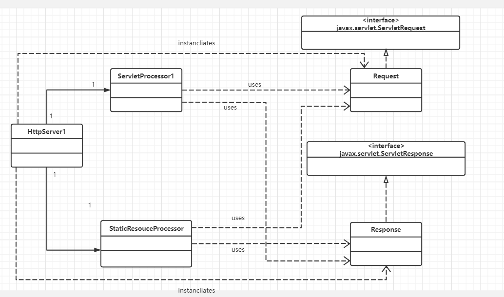

## SimpleServletContainer

- When the servlet is called for the first time, load the servlet class and call the servlet's init method(once only)
- For each request, construct an instance of javax.servlet.ServletRequest and an instance of javax.sersvlet.ServletResponse.
- Invoke the servlet's service method, passing the ServletRequest and ServletResponse objects.
- When the servlet class is shut down, call the servlet's destory method and unload the servlet class.

The first servlet container for this chapter is not fully functional. Therefore, it cannot run other very simple servlets and does not call the servlet's init and destory methods. Instead, it does the following:

- Wait for HTTP request.
- Construct a ServletRequest object and a Servlet Response object
- If the request is for a static resource, invoke the process  method of the StaticResourceProcessor instance, passing the ServletRequest and ServletResponse objects.
- If the request is for a servlet, load the servlet class and invoke the service method of the servlet, passing the Servlet Request and ServletResponse objects.

> NOTE
>
> In this servlet container, the servlet class is loaded every time the servlet is requested.

The first application consists of six classes:

- HttpServer1
- Request
- Response 
- StaticResourceProcessor
- ServletProcessor1
- Constants

